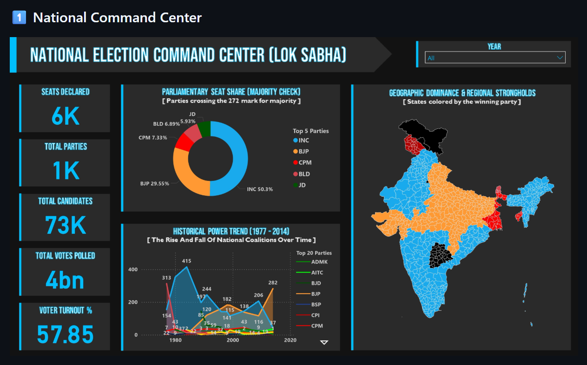
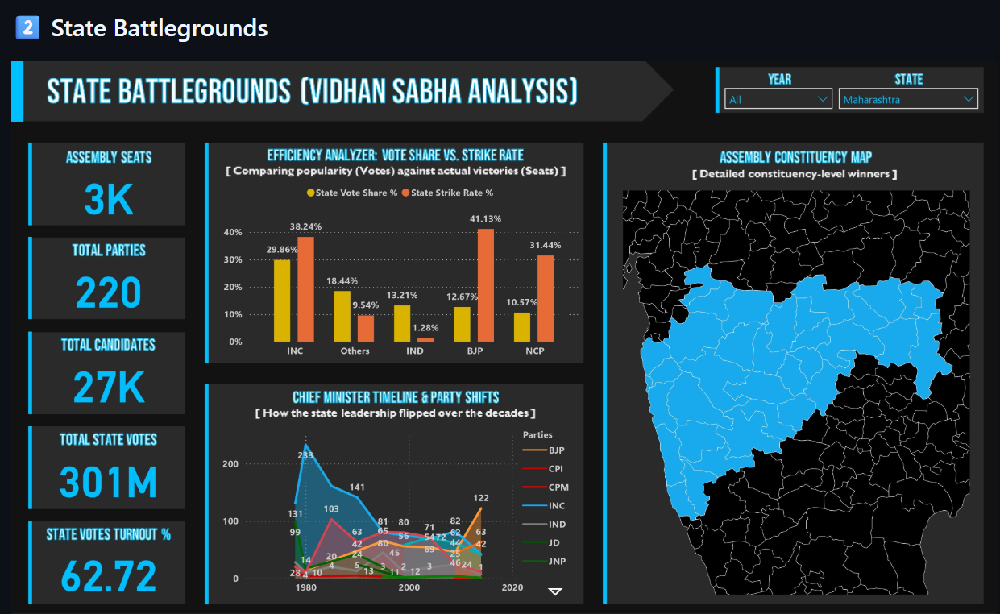
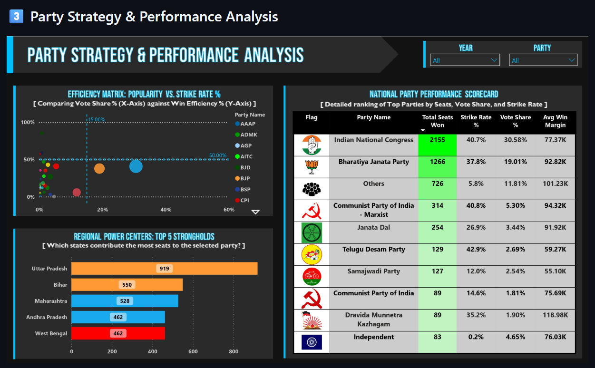
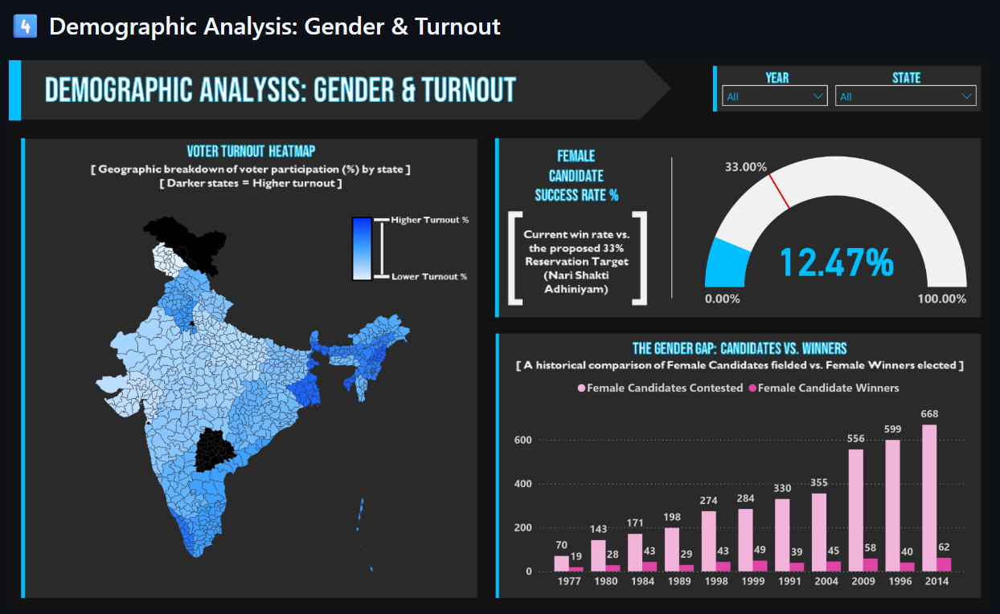
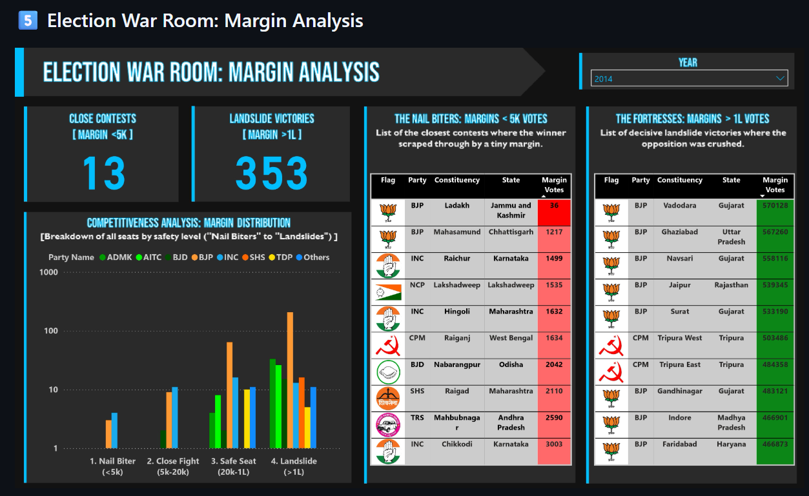

# 📊 ElectiViz: Election Intelligence Dashboard

## 🧠 Project Overview

**ElectiViz** is a **broadcast-quality election analytics platform** built for **newsrooms, political analysts, and data journalists**.

It standardizes and analyzes **400,000+ election records** across nearly **four decades (1977–2014)** of Indian political history to reveal high-impact performance metrics such as:

- Strike Rate  
- Winning Margin  
- Voter Turnout Dynamics  

The platform supports:
- 📡 Live election coverage  
- 🔍 Post-election deep dives  
- 📰 Data-driven political storytelling  

---

## 🖼️ Dashboard Gallery

> *(Add dashboard images inside an `images/` folder and update filenames accordingly)*

### 1️⃣ National Command Center

  

### 2️⃣ State Battlegrounds

  

### 3️⃣ Party Strategy & Performance Analysis

  

### 4️⃣ Demographic Analysis: Gender & Turnout

  

### 5️⃣ Election War Room: Margin Analysis

  

---

## 🛠️ Technical Highlights

### 🔧 Tech Stack
- **Python (Pandas, NumPy)** – ETL and data transformation  
- **Microsoft Power BI** – Interactive dashboards and advanced DAX  
- **Microsoft Excel** – Metadata and asset management  

---

### 🧩 Data Architecture
- **Galaxy Schema (Multi-Fact Architecture)**
- Cross-filtering enabled between:
  - Lok Sabha Elections  
  - Vidhan Sabha Elections  
- Supports **party, state, and demographic slicing**

---

### 📐 Advanced Analytics
- **28+ optimized DAX measures**, including:
  - Strike Rate  
  - Winning Margin %  
  - Dynamic Winning Party Colors  
  - Gender-wise Voter Turnout  
- Performance-tuned for **large datasets**

---

### ✅ Data Validation
- Aggregate reconciliation checks  
- Cross-filtering stress tests  
- Ensures **100% data accuracy**

---

## 🎯 Use Cases
- 📺 Media election coverage  
- 🗳️ Political performance analysis  
- 📊 Academic research  
- 📰 Data journalism  

---

## 👥 Team C

- **Ashish Ransing** – Team Leader  
- **N. Manjushri**  
- **P.D. Varshita**  
- **Pratham S. Salian**  
- **Deepika Kanukanthi**

---

## 📌 Disclaimer

This project is intended **strictly for educational and analytical purposes**.  
All election data used is **publicly available** and processed responsibly.

---

## ⭐ Support

If you find this project useful, please consider giving it a **star ⭐** on GitHub.  
Your support helps motivate continued improvements!
